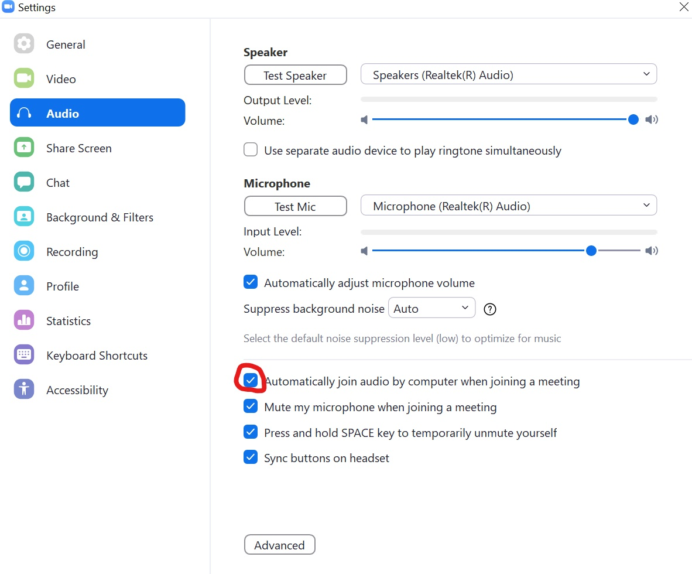

# zoom_launcher
This is a GUI project for automatically launch zoom automatically and can be installed thanks to [Pyinstaller 4.0](https://pypi.org/project/pyinstaller/) module.\
This software is primarily made for student
## Features:
- Automatically launch zoom meeting based on you day and time you set.
- Manual choose which to launch automatically.

## How To Use Guide:
- The first time when you start the program. If there is no **save.txt** and **zoom_path.txt** file inside the folder, it will automatically create it for you.
  - **save.txt**: This is a textfile where all your input is saved.
  - **zoom_path.txt**: This is where you put your zoom.exe path so the program can automatically launch it for you.
- To add the content you can do that in the app's add menu. You can add by _link_ and _meeting ID (recommended)_. To edit or delete the content, you can do that within the _save.txt_ file. When you done editing the content and save the file, the program will automatically restart so it can update the list.\
## Important
Before you use the application, you need some configuration to do.
- Open `zoom_path.txt` and put your zoom.exe full path without spaces.
- In zoom settings, go to `Audio` and checked `Automatically join audio by computer when joining a meeting` checkbox.

- Make sure you're signed in to zoom.
- If you connect zoom meetings through a link, make sure you checked the pop up message's checkbox so it will automatically connect you to the zoom meeting.
- If you want to edit something, you can do that in the `save.txt` file.
  
## How To Contribute:
To contibute you can open an issue to show me problems within the app or an request afor additional features.   